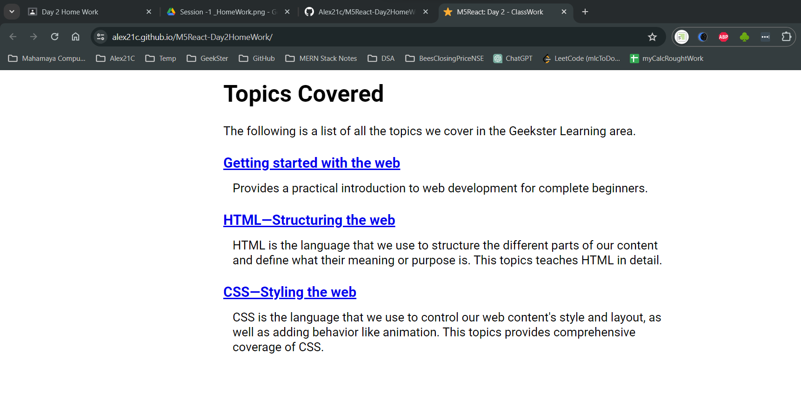

# M5React-Day 2 HomeWork

## Objective
In this project, i will  create a straightforward web page using ReactJS with the assistance of Content Delivery Network (CDN) links. ReactJS is a powerful JavaScript library that allows us to build interactive and dynamic user interfaces. By leveraging CDNs, we can quickly access the necessary React libraries without the need for complex development setups. I have Used the `React.createElement` to create the Element And for rendering it use `React.render`.

## Tech. Stack Used:
+ [React](https://react.dev/)
+ [Babel.js](https://babeljs.io/)
+ [Google Fonts](https://fonts.google.com/)

## Hosted Version of the Project:
[M5React-Day2HomeWork](https://alex21c.github.io/M5React-Day2HomeWork/)

## Author
[Abhishek kumar](https://www.linkedin.com/in/alex21c/), ([Geekster](https://geekster.in/) MERN Stack FS-14 Batch)
